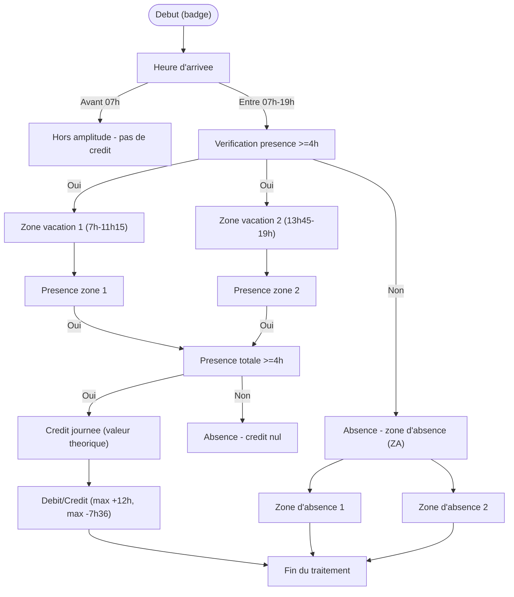

# 🔥 Prométhée AI v2.2

**Assistant IA desktop** — Interface PyQt6 connectée à un LLM (OpenAI-compatible, Albert API ou Ollama), avec outils intégrés, RAG, mémoire long terme et support Légifrance/Judilibre.
**conçu principalement pour fonctionner avec l'API Albert de la DiNum**

---

## ✨ Fonctionnalités

- 💬 **Chat en streaming** avec historique chiffré (AES-GCM)
- 🧠 **Mémoire long terme (LTM)** : résumés vectorisés des conversations passées via Qdrant (première version, va évoluer)
- 🔧 **Outils intégrés** : web, données, export (docx/pptx/pdf/xlsx), analyse de données, Python, SQL, OCR, météo, messagerie IMAP/SMTP, Légifrance, Judilibre, data.gouv.fr, génération automatique d'outils
- 📚 **RAG** (Retrieval-Augmented Generation) via Qdrant et Albert API
- 📊 **Outils collaboratifs** : intégration de l'API Grist
- 🏛️ **APIs juridiques** : Légifrance et Judilibre via PISTE
- 🖥️ **100% local possible** avec Ollama
- 🔒 **Chiffrement optionnel** de la base de données SQLite
- 🎨 **Thème clair/sombre**

---

## 🚀 Installation

### Prérequis

- Python **3.10+ (testé avec 3.12.8)**
- [Tesseract OCR](https://github.com/tesseract-ocr/tesseract) *(optionnel, pour l'OCR)*

```bash
# Ubuntu/Debian
sudo apt install tesseract-ocr tesseract-ocr-fra tesseract-ocr-eng

# macOS
brew install tesseract tesseract-lang
```

### Installation des dépendances

```bash
# Cloner le dépôt
git clone https://github.com/Ktulu-Analog/promethee.git
cd promethee

# Créer un environnement virtuel (recommandé)
python -m venv .venv
source .venv/bin/activate  # Linux/macOS
# .venv\Scripts\activate   # Windows

# Installer les dépendances
pip install -r requirements.txt
```

### Configuration

```bash
# Copier le fichier de configuration
cp .env.example .env

# Éditer .env avec vos paramètres
nano .env
```

Les paramètres essentiels à configurer dans `.env` :

| Variable | Description |
|---|---|
| `APP_VERSION` | Numéro de version affiché dans l'interface (ex : `2.1`) |
| `OPENAI_API_KEY` | Clé API (Albert, OpenAI, etc.) |
| `OPENAI_API_BASE` | URL du serveur LLM |
| `OPENAI_MODEL` | Modèle à utiliser |
| `OAUTH_CLIENT_ID` | Identifiants PISTE (Légifrance / Judilibre) |
| `QDRANT_URL` | URL Qdrant pour le RAG |
| `GRIST_API_KEY` | Clé API Grist |
| `GRIST_BASE_URL` | URL de l'instance Grist (défaut : `https://docs.getgrist.com`) |
| `IMAP_HOST` | Serveur IMAP pour la messagerie |
| `IMAP_PORT` | Port IMAP (défaut : 993) |
| `IMAP_USER` | Adresse e-mail |
| `IMAP_PASSWORD` | Mot de passe IMAP |
| `SMTP_HOST` | Serveur SMTP pour l'envoi *(optionnel)* |
| `SMTP_PORT` | Port SMTP *(optionnel)* |

### Lancement

```bash
python main.py
```

---

## 📁 Structure du projet

```
promethee/
├── core/               # Moteur : config, BDD, LLM, RAG, mémoire, outils
├── tools/              # Outils disponibles pour l'agent
├── ui/                 # Interface graphique PyQt6
│   ├── panels/         # Panneaux : chat, RAG, monitoring
│   ├── widgets/        # Composants réutilisables
│   └── dialogs/        # Boîtes de dialogue
├── skills/             # Guides de compétences injectés en contexte
├── assets/             # Logo, KaTeX
├── scripts/            # Scripts utilitaires (CLI)
│   ├── ingest.py       # Indexation de documents dans Qdrant (mode interactif ou CLI)
│   ├── logview.py      # Lecteur de logs coloré en terminal (filtres, stats, follow)
│   └── download_katex.py  # Téléchargement des assets KaTeX (à exécuter une seule fois)
├── documentation/      # Documentation développeur
│   ├── doc_developpeur_tools.pdf   # Guide de référence pour créer des outils
│   ├── modele_tools.py             # Fichier modèle annoté pour un nouvel outil
│   └── logview_documentation.docx # Documentation complète de logview.py
├── tests/              # Tests unitaires (pytest)
├── main.py             # Point d'entrée
├── prompts.yml         # Prompts système
├── pyproject.toml      # Métadonnées du projet
├── requirements.txt    # Dépendances Python
└── .env.example        # Modèle de configuration
```

---

## 🎨 Rendu riche : LaTeX et diagrammes Mermaid

Prométhée intègre un moteur de rendu LaTeX et Mermaid dans le chat, fonctionnant entièrement en local grâce à des assets embarqués.

### Formules LaTeX — KaTeX

Les formules mathématiques sont rendues via **KaTeX** (assets locaux, aucune connexion requise).

| Syntaxe | Mode | Exemple |
|---|---|---|
| `$ ... $` ou `\( ... \)` | Inline (dans le texte) | `$E = mc^2$` |
| `$$ ... $$` ou `\[ ... \]` | Display (bloc centré) | `$$\int_0^\infty e^{-x}\,dx$$` |

> **Note :** les dollars monétaires (`$42`, `USD$`) sont automatiquement ignorés grâce à une heuristique anti-faux-positifs.

Pour télécharger les assets KaTeX (à exécuter une seule fois après le clonage) :
```bash
python scripts/download_katex.py
```

### Diagrammes Mermaid (version préliminaire)

Les blocs ` ```mermaid ` sont rendus en SVG via **Mermaid.js** (v11.4.1, bundle local).

Tous les types de diagrammes sont supportés : flowchart, séquence, Gantt, état, classe, entité-relation, Sankey, etc.
**Il reste des erreurs dans le moteur de rendu, notamment sur les accents. Ceci est en cours de correction pour une prochaine version**

Voici un exemple de rendu par Prométhée avec Mermaid :
*(prompt : à partir de ce rapport, génère un diagramme de flux pour présenter le système d'horaires souples*)



Pour télécharger l'asset Mermaid (à exécuter une seule fois après le clonage) :
```bash
python scripts/download_mermaid.py
```

---


## 🛠️ Outils disponibles

| Outil | Description |
|---|---|
| `web_tools` | Navigation, scraping web et recherche DuckDuckGo / SearXNG |
| `export_tools` | Génération docx, pptx, pdf, xlsx, md, odt/odp/ods (LibreOffice) |
| `export_template_tools` | Génération docx et pptx depuis un gabarit organisationnel |
| `data_tools` | Manipulation et analyse de données |
| `data_file_tools` | Chargement, transformation et export de fichiers CSV/Excel (pandas) |
| `sql_tools` | Requêtes SQL (SQLite, PostgreSQL, MySQL) |
| `ocr_tools` | OCR via Tesseract |
| `python_tools` | Exécution de code Python sandboxé (venv isolé) |
| `system_tools` | Opérations système (fichiers, dossiers, diff) |
| `skill_tools` | Consultation dynamique des guides de bonnes pratiques (skills) |
| `meteo_tools` | Météo actuelle et prévisions 7 jours via Open-Meteo (sans clé API) |
| `imap_tools` | Lecture, recherche, envoi et gestion d'e-mails via IMAP/SMTP |
| `tool_creator_tools` | Génération automatique d'un nouvel outil Prométhée par le LLM |
| `grist_tools` | API Grist : lecture et écriture dans des tableurs collaboratifs |
| `legifrance_tools` | API Légifrance (PISTE) |
| `judilibre_tools` | API Judilibre (PISTE) |
| `datagouv_tools` | API data.gouv.fr |

---

## 🛠️ Scripts utilitaires

| Script | Description |
|---|---|
| `scripts/ingest.py` | Indexe un répertoire de documents dans Qdrant. Mode interactif ou passage direct des arguments (`--collection`, chemin). |
| `scripts/logview.py` | Lecteur de logs coloré en terminal. Supporte le follow temps réel (`-f`), le filtrage par niveau (`-l`), par module (`-m`), les stats (`--stats`), etc. |
| `scripts/download_katex.py` | Télécharge les assets KaTeX (JS, CSS, polices woff2) dans `assets/katex/`. À exécuter une seule fois après le clonage. |

---

## 🧪 Tests

```bash
pytest tests/
# Avec couverture :
pytest tests/ --cov=core --cov=tools
```

---

## ⚙️ Options avancées

### Utilisation avec Ollama (100% local)

Dans `.env` :
```env
LOCAL=ON
OLLAMA_BASE_URL=http://localhost:11434
OLLAMA_MODEL=nemotron-3-nano:latest
```

### Chiffrement de la base de données

Dans `.env` :
```env
DB_ENCRYPTION=ON
```
Au premier lancement, une passphrase vous sera demandée.

### RAG avec Qdrant

1. Lancer Qdrant : `docker run -p 6333:6333 qdrant/qdrant`
2. Dans `.env` : `QDRANT_URL=http://localhost:6333`
3. Utiliser le panneau RAG dans l'interface pour ingérer des documents

### Mémoire long terme (LTM)

La LTM stocke des résumés vectorisés des conversations passées dans Qdrant et les réinjecte automatiquement en contexte. Configuration dans `.env` :

```env
LTM_ENABLED=ON
LTM_MODEL=mistralai/Mistral-Small-3.2-24B-Instruct-2506
LTM_USE_SUMMARY=OFF     # ON = résumés LLM (meilleure qualité), OFF = chunks bruts
LTM_RECENT_K=2          # Nombre de souvenirs récents réinjectés
```

### Gestion du contexte et de l'agent

```env
AGENT_MAX_ITERATIONS=12            # Nombre max d'itérations de la boucle agent
CONTEXT_CONSOLIDATION_EVERY=8      # Résumé de session tous les N tours
CONTEXT_CONSOLIDATION_PRESSURE_THRESHOLD=0.70  # Consolidation adaptative (% du contexte)
```

### Messagerie IMAP/SMTP

L'outil `imap_tools` remplace l'ancien `thunderbird_tools` et offre une compatibilité universelle avec tout serveur IMAP/SMTP (Gmail, Outlook, Proton Mail, serveurs auto-hébergés…).

```env
IMAP_HOST=imap.example.com
IMAP_PORT=993
IMAP_USER=vous@example.com
IMAP_PASSWORD=votre_mot_de_passe
SMTP_HOST=smtp.example.com
SMTP_PORT=587
```

### Génération automatique d'outils

L'outil `tool_creator_tools` permet au LLM de générer un nouvel outil Prométhée à partir d'une description en langage naturel. Le code généré est validé syntaxiquement avant d'être écrit dans `tools/`.

---

## 📄 Licence

Ce projet est distribué sous licence **AGPL-3.0**.  
Voir [https://www.gnu.org/licenses/agpl-3.0.html](https://www.gnu.org/licenses/agpl-3.0.html).

---

## 👤 Auteur

Pierre COUGET — 2026
